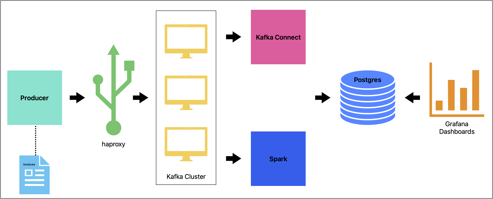

# Escenario de Implementación


Sistema orientado a la recepción de grandes cantidades de facturas (*Invoices*). El almacenamiento de las facturas se asegura 
enviándolas directamente a la base de datos. El sistema también realiza el cálculo de agregados en streaming, basándose en el
flujo de datos recibido.

El repositorio de implementación deberá ejecutarse en Linux/MacOS.

## Elementos del sistema:

**Producer:** Elemento generador de facturas en base a un script sencillo que se encarga de generar valores aleatorios.

**Haproxy:** El consumo de Kafka se realiza por medio de un proxy que se encarga de balancear los requests entrantes entre los brokers de Kafka

**Kafka Cluster:** 3 brokers de Kafka.

**Kafka Connect:** Consumidor que se encarga de tomar facturas y almacenarlas en base de datos.

**Spark (*Streaming Jobs*):** Job encargado de leer en streaming los datos entrantes, generar agregados y almacenarlos en base de datos.

**Postges:** Base de datos relacional empleada para el almacenamiento de facturas y sus agregados.

**Grafana (*Dashboards*):** Elemento empleado para la visualización de dashboards para el ejercicio.

## Configuración del ambiente

**1. Dar permisos de ejecución a los scrips:**

```
chmod +x start_service.sh 
chmod +x producer/producer.sh
```

**2. Ejecutar scripts que arranca la solución:**

```
./start_service.sh
```

**3. Acceso a Dashboards:**

http://localhost:3000/

usuario: admin

contraseña: admin

Ver dashboards:
- Total por Cliente (Kafka Invoice Aggregates)
- Totales por Ciudad (Kafka Stream Aggregates)

**4. Acceso a base de datos:**

http://localhost:8081

usuario: admin@example.com

contraseña: admin123

Crear el servidor para consultar las tablas del esquema:

Server: postgres

Database: demo

User: demo

Password: demo

**5. Verificación del cluster:**

http://localhost:9000

## Solución de errores

- Errores de red: Ejecutar para eliminar redes sin uso: 
podman network prune -f
